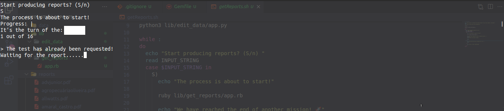

# Navegação

- [Sobre](#sobre)
- [Tecnologias](#tecnologias)
- [Arquivos](#arquivos)
  - [Diretório *data*](#diretório-data)
  - [Diretório *reports*](#diretório-reports)
  - [Arquivo *.env*](#arquivo-env)
- [Funcionamento](#funcionamento)
  - [Menu](#menu)
  - [Gerando relatórios](#gerando-relatórios)

# Sobre

Esses scripts foram criados para automatizar uma tarefa que eu realizava, enquanto cuidava da otimização de alguns sites. A tarefa automatizada foi a criação de relatórios, usados para avaliar o desempenho dos sites. Antes, a tarefa era realizada de forma manual, por meio da plataforma [GTmetrix](https://gtmetrix.com/). No entanto, com a API que é disponbilizada pela plataforma, eu acabei automatizando essa tarefa.

OBS: Como eu não realizava mais essa tarefa (otimização de sites feitos com WordPress), eu acabei esquecendo desses scripts, só relembrando dos mesmos quando fui formatar o computador :D. Criei este repositório para compartilhar a ideia e deixá-la documentada.

# Tecnologias

Os dois principais scripts estão nos diretórios *src/edit_data* e *src/get_reports*, um escrito em `Python` e o outro em `Ruby`, respectivamente. O motivo para o uso das duas linguagens foi simplesmente obter mais prática. Além dessas linguagens, foi utilizado a linguagem de script `Shell Script`, para gerenciar a execução dos scripts.

# Arquivos

Para que os relatórios possam ser gerados, alguns arquivos e diretórios devem existir. Abaixo são apresentadas cada um deles e suas respectivas descrições.

## Diretório *data*

Nesse diretório devem ser criados dois arquivos, um chamado `data.txt` e outro chamado de `preload_data.txt` (o funcionamento dos scripts se dá por meio de arquivos de texto). O arquivo `data.txt` deve inicialmente ficar vazio, e não deve ser manipulado posteriormente. Já o arquivo `preload_data.txt` deve conter as informações dos sites que serão testados.

O seguinte padrão foi utilizado para salvar as informações do sites, no arquivo `preload_data.txt`:

```
NomeDoSite MM/AAAA URLDoSite
OutroSite MM/AAAA URLDoOutroSite
...
```

Inicialmente temos o nome do site (sem espaços), o mês e ano (quando o site foi criado, seria utilizado para outro propósito) no formato MM/AAAA e por fim o endereço do site. Portanto, o conjunto de informações de um site deve estar em apenas uma linha.

O arquivo `data.txt` será utilizado para guardar as informações processadas pelos scripts, essas informações serão armazenadas no formato json. Abaixo é apresentado um exemplo de como o conjunto de informações de um site é armazenado.

```
{
  "name": "NomeDoSite", 
  "time": {
    "month": "MM", 
    "year": "AAAA"
  }, 
  "url": "URLDoSite"
}
```

## Diretório *reports*

Nesse diretório serão salvos os relatórios no formato pdf, gerados pelos scripts.

## Arquivo *.env*

Até o momento, a única variável necessária para o funcionamento dos scripts será o **API_USERNAME**, que é gerado pela plataforma GTmetrix.

# Funcionamento

Como dito anteriormente, os scripts usam a API disponibilizada pela GTmetrix. Toda a documentação sobre o funcionamento da API está disponível em: [GTmetrix REST API v2.0](https://gtmetrix.com/api/docs/2.0/). Para gerar a **API_USERNAME** você deverá se cadastrar na plataforma.

Antes de rodar os scripts, além da necessidade de criar alguns diretórios e arquivos, também precisamos lidar com as dependências. Para instalar as gems usadas no script em Ruby, rode o seguinte no seu terminal:

```
$ bundle install
```

O script escrito em Python não possui dependências. Agora, para que você possa rodar os scripts, você precisa conceder a permissão de execução para o arquivo `getReports.sh`. Para fazer isso, rode o seguinte comando no seu terminal:

```
$ chmod +x getReports.sh
```


Dado que você já realizou todas as configurações anteriores, para começar a gerar os relatórios, você deverá rodar o script `getReports.sh`. Para isso, rode o comando:

```
$ ./getReports.sh
```

Lembre-se, você deve estar no diretório do projeto, quando rodar os comandos acima.

Após alguns segundos (delay proposital), um menu deverá aparecer no seu terminal (script em Python). Abaixo uma imagem apresenta como deverá ser a visualização no terminal.


<p align="center"><em>Visualização do menu inicial.</em></p>

## Menu

Algumas observações devem ser feitas a respeito das opções do menu. As opções de 1 à 4, manipulam os dados que foram lidos do arquivo `data.txt`. A opção 5 carrega os dados do arquivo `preload_data.txt` e posteriormente deverá salvar os dados formatados no arquivo `data.txt`. A opção 6 limpa o arquivo  `data.txt`. Quando você sair do menu, usando a opção 0, você poderá escolher se quer gerar os relatório ou não.

## Gerando relatórios

Caso você escolhar a opção de gerar os relatórios (S), a visualização no seu terminal deverá ser a seguinte:


<p align="center"><em>Visualização dos scripts em funcionamento.</em></p>

Os relatório serão gerados com base no dados salvos no arquivo `data.txt`, ou seja, com informações que podem ter sido carregadas do arquivo `preload_data.txt` ou apenas com as informações fornecidas pelo terminal, via menu.

Se os relatórios forem gerados com sucesso, você deverá receber a seguinte mensagem:

<div align="center">
  
  <p><em>Mensagem de finalização.</em></p>
</div>
